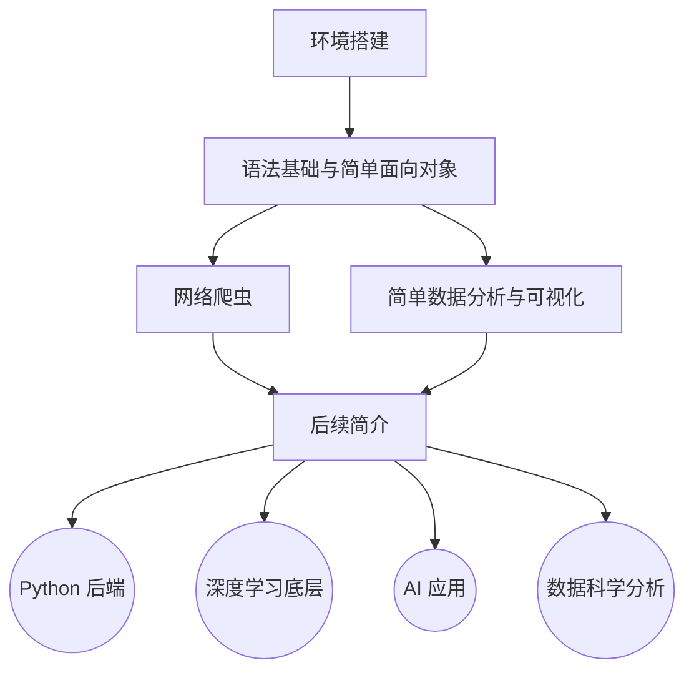

# west2-online AI 考核指南

欢迎来到西二在线工作室人工智能方向的考核指南。本指南旨在为初学者提供一条循序渐进的人工智能学习路线，帮助你系统性地掌握人工智能的核心知识与技能。

## 版权声明

本项目遵循 GPL-3.0 License。如需转载，请注明本项目仓库地址。

## 文档结构

所有的考核相关文档遵循：学习目的 - 学习内容 - 学习要求（可能没有） - 作业 - 推荐教程与参考资料的目录结构编写。

> 从往年的经验来看，无人在意“推荐教程与参考资料”这部分内容，因此将之移到作业之后。但是我希望你能认真地看完这部分内容，这部分不只是推荐的教程，还有更多有用的信息。

除此之外，我们还会提供各种补充资料，这部分并非考核内容，但是如果你想学得更好，可以参考这些资料。

## AI 学习路线总览

考核大致分为两个阶段，[Foundation](./tasks(2026)/foundation) 和 [Science Research](./tasks(2026)/science-research) / [Application](./tasks(2026)/application)。[Foundation](./tasks(2026)/foundation) 是共通路线，在完成 [Foundation](./tasks(2026)/foundation) 后，你需要从 [Science Research](./tasks(2026)/science-research) 和 [Application](./tasks(2026)/application) 两者里选择一个。

如果你想保研，未来想进实验室，那么建议选前者。

如果你未来想找工作，那么可以选择后者。

关于更具体的建议，以及为什么会有 [Python Backend](./tasks(2026)/backend)、[Python Frontend](./tasks(2026)/frontend) 和 [Statistics](./tasks(2026)/statistics)，可以见 [Foundation](./tasks(2026)/foundation) 文件夹的 [task4.md](./tasks(2026)/foundation/task4.md)，这是关于未来的导入。

### 成为正式成员后的权益

通过所有考核后，你将成为西二在线网络工作室的正式成员，并获得以下权益：

- 成员证书
- 使用工作室的计算资源，组队参与算法竞赛
- 获得外包项目与企业实习机会
- 拥有固定的个人工位及活动室使用权
- 参与科研合作项目
- ~~玩无人机~~

## 如何开始

请点开 [tasks(2026)](./tasks(2026)) 文件夹，从 [foundation](./tasks(2026)/foundation) 文件夹中的 [task1.md](./tasks(2026)/foundation/task1.md) 开始学习。

我们的学习希望是以一个文档引导 + 个人自学的方式。我们会告诉你应当如何快速的上手，但是你想要学好、学懂，除了我们的引导外你还需要自己的个人提升。

从功利的角度出发, 如果你想进 west2-online 工作室，你需要在完成基础内容的基础上，适当的完成一定量的 选做 和 Bonus 内容。

我们的答辩会考察你一定的知识储备。

## 作业提交方式

你需要阅读[作业提交指南](./tasks(2026)/commit-task/work-commit.md)来了解作业提交的具体要求和流程。

你还需要阅读[Git 使用指南](./tasks(2026)/commit-task/git-study.md)来了解 Git 的使用方法。

## 详细说明

更多关于考核设计的思考，请参考 [ShaddockNH3 的博客文章](https://shaddocknh3.github.io/p/%E6%9C%89%E5%85%B3ai%E5%AD%A6%E4%B9%A0%E8%B7%AF%E7%BA%BF%E7%9A%84%E6%80%9D%E8%80%83/)。

这篇博客仍在优化中。

## 加入我们

欢迎扫码加入 AI 方向学习交流群，与其他学习者共同进步。

